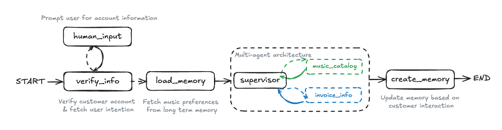
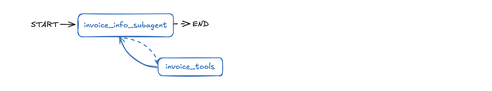
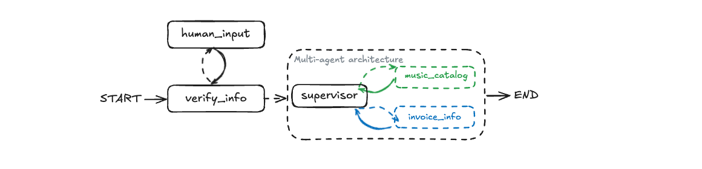
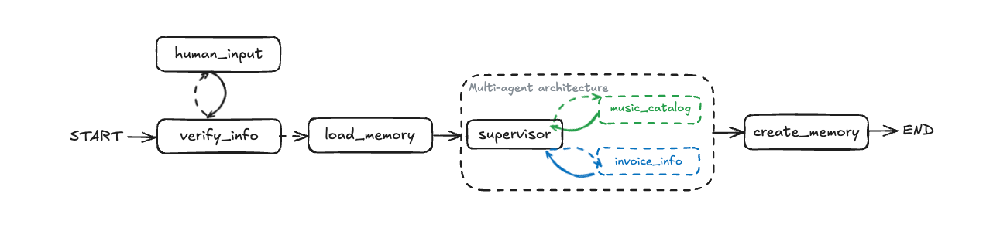
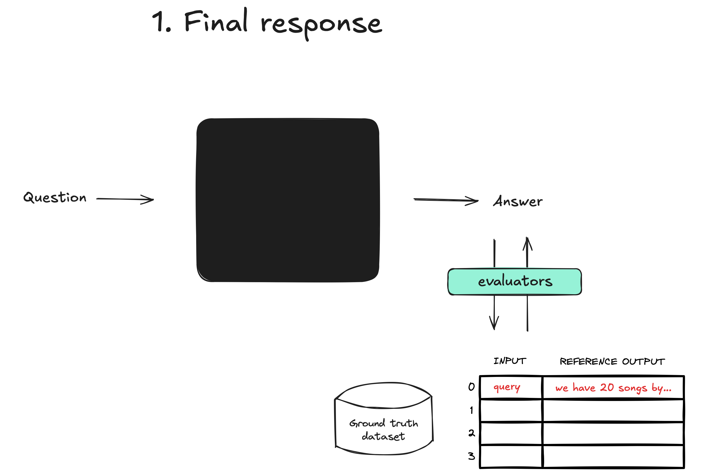
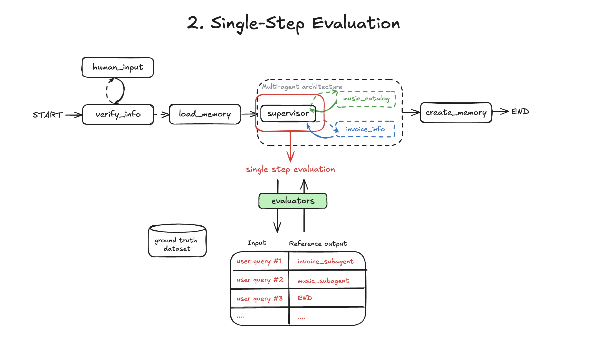
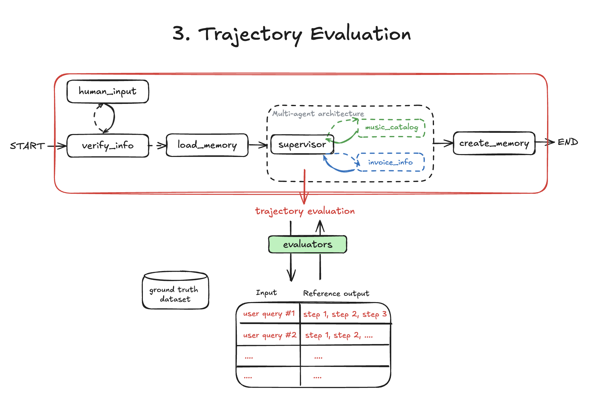
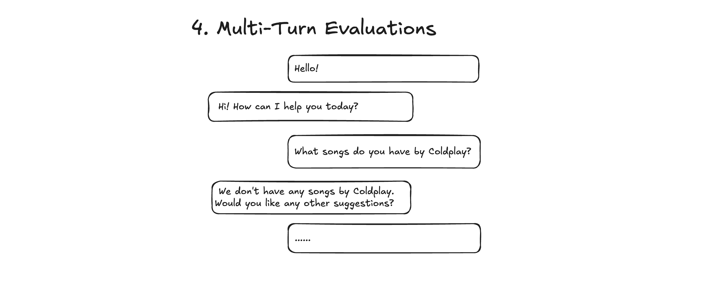

# LangGraph-Teaching-Tools

[](https://github.com/langchain-ai/langchainjs/blob/main/LICENSE)
[](https://langchain-ai.github.io/langgraphjs/)
[](https://github.com/langchain-ai/langgraph-101-ts)

歡迎使用 TypeScript 版 LangGraph-Teaching-Tools！

## 簡介

本專案是介紹如何使用 LangChain v1 與 LangGraph v1 建置代理的基礎概念。這是 LangChain Academy 的精簡版本，預期在 LangChain 工程師帶領的課程中執行。如果你想更深入學習，或自行完成教學，可參考 [LangChain Academy](https://academy.langchain.com/courses/intro-to-langgraph)。LangChain Academy 包含由 LangChain 工程師錄製的實用影片。

**本專案僅做個人學習使用**。設計為透過 LangGraph 執行 `/agents` 資料夾中的代理。每個代理都建立在前一個概念之上，形成循序漸進的學習體驗，讓你可以即時視覺化並互動。

## 背景

在 LangChain，我們的目標是讓建置 LLM 應用程式變得簡單。代理是你可以建置的一種 LLM 應用。大家對建置代理非常感興趣，因為代理能自動化許多過去難以完成的任務。

但實務上，要建置能可靠執行這些任務的系統非常困難。在協助使用者將代理導入正式環境的過程中，我們發現通常需要更多控制能力。例如，你可能需要代理永遠先呼叫特定工具，或依照自身狀態使用不同提示詞。

為了解決這個問題，我們建置了 [LangGraph](https://langchain-ai.github.io/langgraph/)：一個用於建置代理與多代理應用程式的框架。LangGraph 獨立於 LangChain 套件，其核心設計理念是協助開發者在代理工作流程中加入更好的精準度與控制力，以應對真實世界系統的複雜度。

## 課前準備

### 1. 設定環境

建立包含 API keys 的 `.env` 檔案：

```bash
# 複製範例檔案並填入你的 keys
cp .env.example .env
```

接著加入你的 API keys。

如果因限制（例如公司政策）而無法取得必要 API keys，請聯絡你的 LangChain 代表，我們會協助找出替代方案。

### 2. 安裝依賴

請確認已安裝 Node.js (v20+) 與 pnpm：

```bash
# 如果尚未安裝 pnpm，請先安裝
npm install -g pnpm

# 安裝所有專案依賴
pnpm install
```

### 3. 啟動 LangGraph Studio

LangGraph Studio 是用於開發與除錯 LangGraph 應用程式的視覺化 IDE。若要執行專案代理：

```bash
pnpm langgraphjs dev
```

這個命令會：

- 在 `http://localhost:2024` 啟動 LangGraph API server
- 自動在瀏覽器中開啟 LangGraph Studio
- 監看 TypeScript 檔案變更並 hot-reload
- 載入 `langgraph.json` 中定義的全部 6 個專案代理

**Studio 選項：**

- 使用 `--port <number>` 變更預設 port
- 如果你使用 Safari（會阻擋 localhost 連線），請使用 `--tunnel`
- 使用 `--no-browser` 略過自動開啟瀏覽器

Studio 執行後，你會在側邊欄看到所有可用的專案代理。從「LG101 Agent」開始，並依序完成編號代理 (00-05)，以跟隨專案課程。

## 專案結構

本專案在 `/agents` 資料夾中包含 6 個代理，每個代理都展示更進階的 LangGraph 概念。建議依序完成，以獲得最佳學習體驗。

### Agent 00: LG101 Agent (`00-lg101_agent.ts`)

**概念**：基本代理建立、工具與簡單工作流程

一個簡單的天氣代理，用於介紹 LangGraph 基礎概念：

- 使用 `createAgent()` 建立代理
- 使用 `tool()` 函式定義並使用工具
- 匯出 graphs 供 LangGraph Studio 使用

**試試看**：詢問不同城市的天氣，觀察代理如何呼叫天氣 API。



### Agent 01: Music Catalog Subagent (`01-music_subagent.ts`)

**概念**：StateGraph、自訂節點、條件邊、資料庫整合

一個專門處理音樂目錄查詢的 subagent：

- 使用 `StateGraph` 手動建構 graph
- 使用 Zod schemas 進行自訂狀態管理
- 多個資料庫工具（依藝人、曲風、歌曲搜尋）
- 根據工具呼叫決定條件邊
- 記憶儲存 (`MemorySaver`, `InMemoryStore`)

**試試看**：依藝人搜尋歌曲、依曲風瀏覽，或確認特定曲目是否可用。


### Agent 02: Invoice Subagent (`02-invoice_subagent.ts`)

**概念**：針對特定領域的簡化代理建立方式

一個專門處理發票與帳務查詢的 subagent：

- 使用 `createAgent()` 更簡單地建立 graph
- 領域專用工具設計
- 使用客戶脈絡進行資料庫查詢

**試試看**：依日期或價格查詢發票，或查詢交易相關員工資訊。



### Agent 03: Supervisor (`03-supervisor.ts`)

**概念**：多代理協調、工具委派

一個在專門 subagents 之間協調的 supervisor 代理：

- 使用工具將任務委派給 subagents
- 將查詢路由到合適的專家代理
- 合併多個代理的回應
- 在代理之間共享狀態

**試試看**：提出混合查詢，例如「AC/DC 有哪些歌曲，以及我最近的發票有哪些？」並觀察 supervisor 如何路由到不同 subagents。


### Agent 04: Supervisor with Verification (`04-supervisor_with_verification.ts`)

**概念**：Human-in-the-loop、客戶驗證、interrupts

透過客戶身分驗證加入安全性：

- 使用 `interrupt()` 建立 human-in-the-loop 工作流程
- 使用 email、phone 或 ID 驗證客戶
- 透過資料庫查詢進行驗證
- 根據驗證狀態進行條件路由
- 具備狀態持久化的多步驟工作流程

**試試看**：開始一段對話，觀察代理在處理請求前如何要求身分識別資訊。



### Agent 05: Supervisor with Memory (`05-supervisor_with_memory.ts`)

**概念**：長期記憶、個人化、記憶管理

具備客戶偏好與記憶的完整系統：

- 使用 `InMemoryStore` 儲存長期記憶
- 擷取並儲存使用者偏好
- 感知記憶的工具呼叫
- 根據歷史紀錄產生個人化回應
- 建立與更新記憶

**試試看**：在多段對話中分享你的音樂偏好，觀察代理如何記住並使用這些資訊。



### 架構圖

`/images` 資料夾包含每種代理模式的架構圖。進行代理練習時可參考這些圖，以視覺化方式理解工作流程結構。

## 使用評估測試你的代理

在 LangGraph Studio 中建置並實驗代理後，你可以使用自動化評估來衡量其表現。`/evals` 資料夾包含可直接執行的評估腳本。

### 為什麼要執行評估？

評估能協助你：

- **抓出錯誤**：辨識代理未如預期運作的情況
- **比較版本**：確認變更是否改善或降低表現
- **建立信心**：確保代理已準備好進入正式環境

### 評估內容

評估腳本測試代理行為的 4 個面向：

**1. Final Response** (`01-final-response.ts`)：代理是否給出正確的最終答案？



**2. Single-Step** (`02-single-step.ts`)：supervisor 是否路由到正確的 subagent？



**3. Trajectory** (`03-trajectory.ts`)：代理是否呼叫了正確的工具序列？



**4. Multi-Turn** (`04-multi-turn.ts`)：代理是否能妥善處理完整對話？



### 執行評估

每個評估都是可獨立執行的腳本：

```bash
npx tsx evals/01-final-response.ts
npx tsx evals/02-single-step.ts
npx tsx evals/03-trajectory.ts
npx tsx evals/04-multi-turn.ts
```

**前置條件：**

- 將 `LANGSMITH_API_KEY` 加入 `.env` 檔案（可在 [smith.langchain.com](https://smith.langchain.com) 免費取得）
- 執行 `pnpm install` 確保已安裝所有依賴

每個評估完成後，你會取得一個 LangSmith URL，可查看詳細結果、比較 runs，並檢視 execution traces。

**深入了解**：請參考完整的 [evaluations documentation](https://docs.langchain.com/langsmith/evaluation-concepts)，了解如何自訂評估與建立自己的評估。

## 更換模型供應商

所有代理都使用 `agents/utils.ts` 中定義的共用模型設定。若要從 OpenAI 切換到不同供應商，只需要修改該檔案中的 **一行**。

### Azure OpenAI

1. 在 `.env` 檔案中設定環境變數：

    ```bash
    AZURE_OPENAI_API_KEY=your-azure-key
    AZURE_OPENAI_ENDPOINT=your-azure-endpoint
    AZURE_OPENAI_API_VERSION=2024-02-15-preview
    ```

2. 在 `agents/utils.ts` 中取代 `defaultModel` 那一行：

    ```typescript
    export const defaultModel = await initChatModel("azure_openai:gpt-4o", {
      azureOpenAIApiKey: process.env.AZURE_OPENAI_API_KEY,
      azureOpenAIApiInstanceName: "your-instance-name",
      azureOpenAIApiDeploymentName: "your-deployment-name",
      azureOpenAIApiVersion: process.env.AZURE_OPENAI_API_VERSION,
    });
    ```

### Anthropic Claude

1. 在 `.env` 檔案中設定環境變數：

    ```bash
    ANTHROPIC_API_KEY=your-anthropic-key
    ```

2. 在 `agents/utils.ts` 中取代 `defaultModel` 那一行：

    ```typescript
    export const defaultModel = await initChatModel("anthropic:claude-3-5-sonnet-20241022", {
      apiKey: process.env.ANTHROPIC_API_KEY,
    });
    ```

### AWS Bedrock

1. 在 `.env` 檔案中設定環境變數：

    ```bash
    AWS_REGION=us-east-1
    AWS_ACCESS_KEY_ID=your-access-key
    AWS_SECRET_ACCESS_KEY=your-secret-key
    ```

2. 在 `agents/utils.ts` 中取代 `defaultModel` 那一行：

    ```typescript
    export const defaultModel = await initChatModel("bedrock:anthropic.claude-3-5-sonnet-20241022-v2:0", {
      region: process.env.AWS_REGION || "us-east-1",
      credentials: {
        accessKeyId: process.env.AWS_ACCESS_KEY_ID,
        secretAccessKey: process.env.AWS_SECRET_ACCESS_KEY,
      },
    });
    ```

**注意**：這些範例也已作為註解寫在 `agents/utils.ts` 中，方便查閱。
